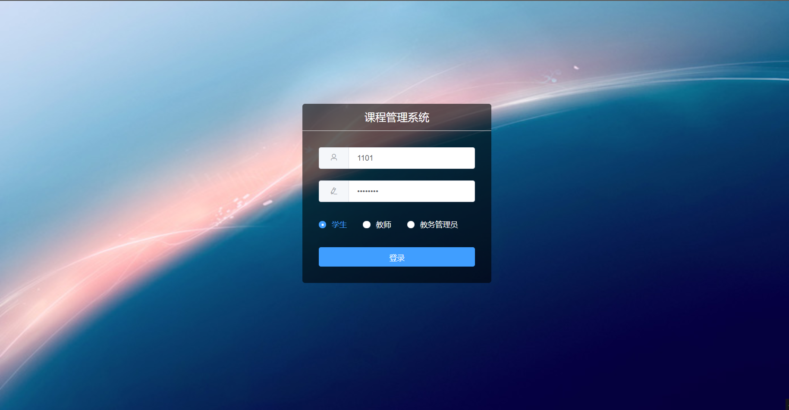

# 教务管理系统ETMS
数据库大作业，学生选课系统，前后端分离。使用流行技术栈Vue ElementUI SpringBoot，Redis实现分布式Session，AOP记录日志由MongoDB存储

@author WLL

## 技术栈

### 前端Vue.js

- ElementUI
- axios
- v-charts(Echarts在)

### 后端SpringBoot

- ORM框架: Mybatis Plus
- 授权认证: SpringBoot
- 会话: Spring Session + Redis
- 日志: AOP + MongoDB

### 数据库

- MySQL: 核心业务
- Redis: Session、新闻、配置信息
- MongoDB: 业务日志

## 项目截图

其它存放在images文件夹下